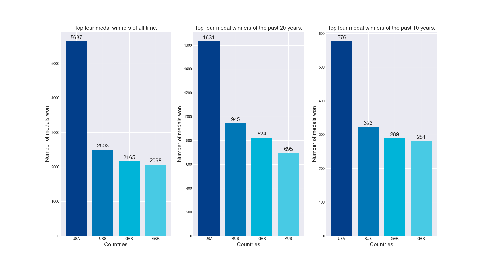
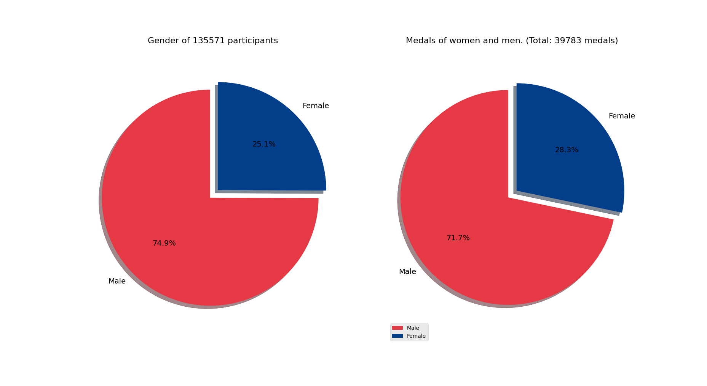
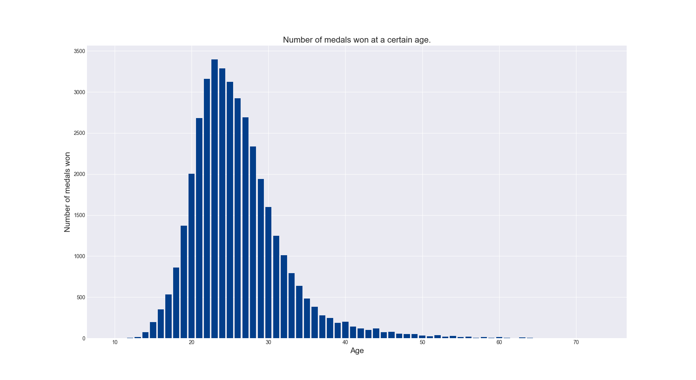
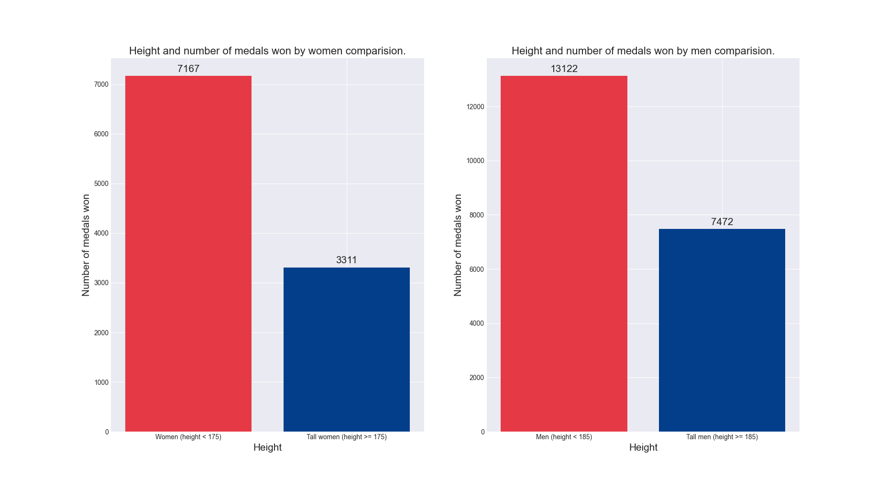
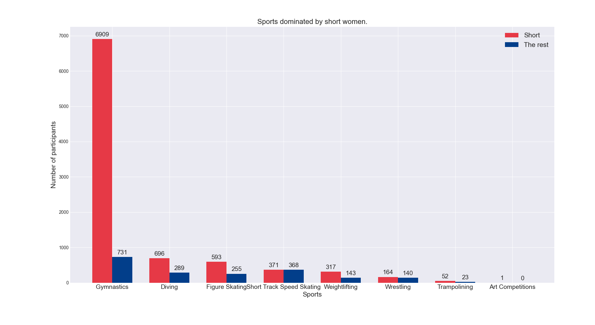
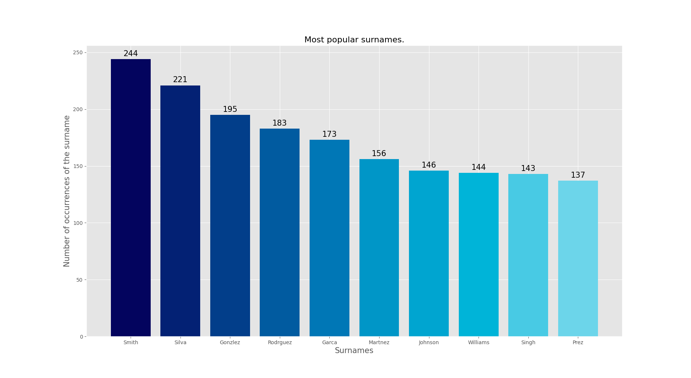

# ONELY-Intern-tasks-data-analysis
We would like to analyze the dataset containing information about the Olympics.
### The dataset is available here:
https://www.kaggle.com/mysarahmadbhat/120-years-of-olympic-history

## Questions to answer:
1. What countries receive the most medals nowadays? Does it change much across thetimespan?
2. Who wins the most medals? Women or men?
3. What’s the trend for the number of participants?
4. What is the relation between age and medals won?
5. Do tall people win more medals?
6. Which sports are dominated by short people? (You must define "short")
7. Which families (same surname) win the most medals?

### 1. Winning medals.

> When it comes to winning medals, the US dominates the rest of the countries. The top 4 doesn't change much over the years and we can observe that Germany, Great Britain and Russia also win a lot of them. [See the script.](https://github.com/Endrju00/ONELY-Intern-tasks-data-analysis/blob/main/medals.py)

### 2. The relationship between medal winning and gender.

> Men dominate in terms of numbers at the Olympics. But as we can observe, the ratio of the medals won to the number of representatives of the given genders is comparable. [See the script.](https://github.com/Endrju00/ONELY-Intern-tasks-data-analysis/blob/main/gender.py)

### 3. Trend for the number of participants.

> As for the number of participants in the Olympics, it is still growing every year. [See the script.](https://github.com/Endrju00/ONELY-Intern-tasks-data-analysis/blob/main/participants.py)

### 4. Relation between age and medals won.

> Most players win medals aged 21-27. An interesting fact is that the youngest medal winner was 10 years old and he won it in 1896 in Athens. [See the script.](https://github.com/Endrju00/ONELY-Intern-tasks-data-analysis/blob/main/age.py)

### 5. Do tall people win more medals?

> The average height of male players is about 179cm and 168cm for women. I assumed that the tall person is more or equal 185cm as a man and 175cm as a woman. Tall people do not win more medals than others. [See the script.](https://github.com/Endrju00/ONELY-Intern-tasks-data-analysis/blob/main/height.py)

### 6. Sport for the short.
> Based on the above assumptions, a short person is less than 175cm as a man and 165cm as a woman.
###

> The sports that are dominated by short men are: Gymnastic, Wrestling, Boxing, Weightlifting, Diving and Trampoling. 
###

###
> The sports that are dominated by short women are: Gymnastic, Figure skating, Short Track Speed Skating, Weightlifting, Wrestling and Trampoling.
###
> Keeping your balance is a skill that is important in each of these sports. This ability is seen more often in people of short stature. [See the script.](https://github.com/Endrju00/ONELY-Intern-tasks-data-analysis/blob/main/short.py)

### 7. Family.

> Due to the data format, the surname had to be extracted from the "name" column. The chart above shows the number of surnames that either follow the first name or was at the end of a multi-segment surname.
